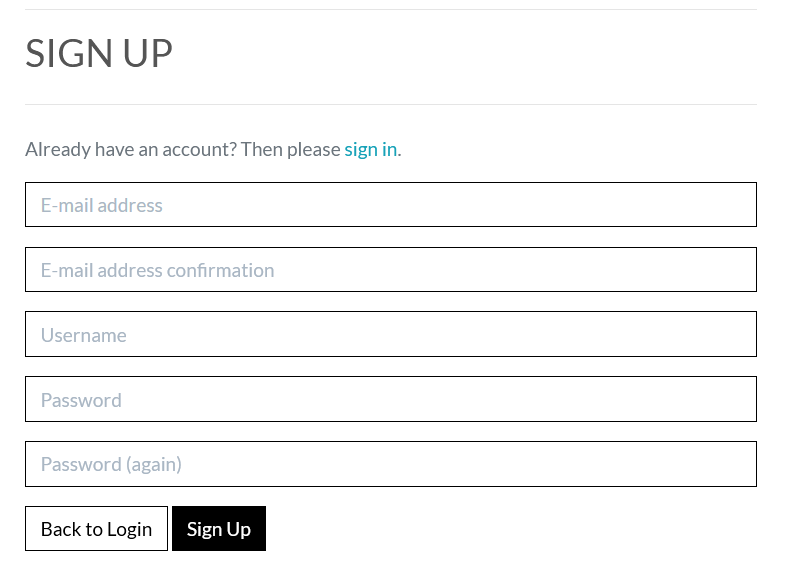

# Live Link to the project website [Wink](https://app-wink-b5e6bffc56ae.herokuapp.com/)


Github link to the project [Github link](https://github.com/caninereason/wink)


## CONTENTS

- [Wink](#Wink)
  - [CONTENTS](#contents)
  - [User Experience (UX)](#user-experience-ux)
    - [Key Information for the site](#key-information-for-the-site)
    - [Business Model](#business-model) 
    - [User Stories](#user-stories)
      - [User Features](#user-features) 
      - [Admin Features](#admin-features)
      - [Client Goals](#client-goals)
      - [Returning and Frequent Visitor Goals](#returning-and-frequent-visitor-goals)
  - [Design](#design)
    - [Typography](#typography)
    - [Imagery](#imagery)
  - [Features](#features)
    - [Home Page](#home-page)
    - [The Navigation Bar](#the-navigation-bar)
    - [Footer](#footer)
    - [Cart](#cart)
    - [Checkout](#checkout)
    - [Order Confirmation](#order-confirmation)
    - [Login/Logout](#loginlogout---set-up-using-allauth)
    - [Register](#register---set-up-using-allauth)
    - [User Profile Details](#user-profile-details)
    - [Admin Features](#admin-features)
    - [Future Implementations](#future-implementations)
  - [Technologies Used](#technologies-used)
    - [Languages Used](#languages-used)
    - [Frameworks](#frameworks)
    - [Libraries \& Programs Used](#libraries--programs-used)
    - [Accessibility](#accessibility)
  - [Deployment \& Local Development](#deployment--local-development)
    - [Deployment](#deployment)
      - [**Create the Live Database**](#create-the-live-database)
      - [**Heroku app setup**](#heroku-app-setup)
      - [**Preparation for deployment in Codeanywhere**](#preparation-for-deployment-in-codeanywhere)
    - [Local Development](#local-development)
      - [How to Fork](#how-to-fork)
      - [How to Clone](#how-to-clone)
  - [Testing](#testing)
    - [Full Testing](#full-testing)
    - [W3C Validator](#w3c-validator)
    - [Solved Bugs](#solved-bugs)
    - [Lighthouse](#lighthouse)
    - [Credits](#credits)
    - [Code Used](#code-used)
    - [Content](#content)
    - [Media](#media)
    - [Acknowledgments](#acknowledgments)

---

## User Experience (UX)

- Wink is an innovative e-commerce platform dedicated to empowering artists to share, distribute, and sell their work. Designed as a vibrant community for creators across various disciplines, Wink offers a suite of intuitive tools to showcase art, engage with audiences, and manage sales. It's a space where artists connect with art enthusiasts, gain exposure, and tell their unique stories. For art lovers, Wink is a treasure trove of original pieces, offering direct access to a diverse world of creativity and the artists behind it. 

### Key Information for the site

- Exclusive Focus on Prints and Paintings: Wink specializes in a curated selection of prints and paintings, catering to a wide range of artistic tastes and preferences.

- Platform for Emerging and Established Artists: The site provides a space for both up-and-coming and seasoned artists to display and sell their work, fostering a diverse artistic community.

- Support for Artists: Wink emphasizes supporting artists, allowing them to gain exposure and directly sell their artwork to a broad audience.

- Diverse Art Collection: The platform offers a variety of artworks, making it an ideal destination for collectors and art enthusiasts looking to discover new talents and unique pieces.

- User-Friendly Shopping Experience: Designed for easy navigation, the site ensures a smooth and enjoyable shopping experience for buyers looking to purchase art online.

- Direct Artist-Customer Connection: Wink facilitates a direct link between artists and customers, enhancing the buying experience with a personal touch and allowing art lovers to learn more about the artists and their work. 

### Business Model

- Wink

- Commission on Sales: Wink earns revenue by taking a commission on each piece of art sold through the platform, providing a steady income stream as artists sell their work.

- Artist Subscription Fees: The platform may charge artists a subscription or listing fee to showcase their work, ensuring a consistent revenue regardless of sales.

- Featured Artist Promotions: Wink could offer paid promotion opportunities for artists who want to feature their work prominently on the site, generating additional revenue.

- Artwork Auctions: Implementing a bidding system for unique or high-demand pieces could be a part of the revenue model, attracting competitive pricing and increased interest.

- Affiliate Marketing and Partnerships: Collaborating with art supply companies, galleries, and other related businesses, Wink can earn through affiliate marketing or partnership deals.

- Exclusive Events and Memberships: Offering exclusive memberships or access to special events, like virtual gallery tours or artist meet-and-greets, can be an additional revenue stream.

[Facebook Business Page](https://www.facebook.com/wink.414444)


### User Stories


## User Features

1. I want to browse a gallery of available artworks, so that I can choose the ones I am interested in purchasing.
2. I want to view the details of a specific artwork, so that I can make an informed decision about my purchase.
3. I want to register an account on the website, so that I can access exclusive offers and maintain a personalized profile.
4. I want to log in and out of my account, so that I can securely access my preferences and history.
5. I want to update my profile information (name, email, address, etc.), so that I can ensure my contact and delivery information is current.
6. I want to add artworks to my shopping cart, so that I can conveniently manage my selections before checkout.
7. I want to view the contents of my shopping cart, so that I can review my selections and make any necessary changes before purchase.
8. I want to place an order for the artworks in my cart, so that I can complete the purchase and own the selected pieces.
9. I want to see ratings and reviews on artworks, so that I can gauge the popularity and reception of pieces to aid in my decision-making.

## Admin Features

1. **I want to** log in and log out of my admin account, **so that I can** have secure access to the website admin features while keeping this information protected.
2. **I want to** manage the list of available artworks, including adding, editing, and deleting items, **so that I can** edit and maintain the list, ensuring it is up to date and correct.
3. **I want to** view a list of registered users and their profile information, **so that I can** address inquiries or issues and ensure a safe, secure, user-friendly experience.
4. **I want to** receive notifications or emails when a new order is placed or when a user submits a review, **so that I can** be kept informed of important events happening on the website and respond in a timely fashion.


Github Project


#### Client Goals

- My client goals for this website are the following:
    - Increase sales for the client selling the artwork to an online market.
    - Enchance User Experience - Making a user friendly website where users can navigate easily and complete any purchases with ease. 
    - Build Brand Awareness - With the website, the newsletter , and a facebook business page, this opens up Wink to a wide range of  potential customers. 
    - Customer Loyalty - Offering a online discount on orders could encourage users to sign up to the site, which encourages loyalty and repeat business
    - Ensuring Security and Data Protection - Ensuring the client meets security and data protection that is needed for online transactions and hosting a secure environment. 
    - Improving the SEO Ranking - Adding robots.txt and sitemap.xml and key meta data to the website encourages a higher ranking on SEO. 

#### First Time Visitor Goals

- My goals for users visiting the website for the first time are the following:
    - The website captures the attention of the user and they fully understand easily what the website is about and what it offers. 
    - Easy Navigation around the website, making it easy to find the information they want. 
    - Highlight the key features of Wink, the artwork, the artists, the discount available
    - Encouraging the use of the social media links, where users may be able to find out more information about Wink, but crucually share Wink to friends and family which hopefully results in more visitors to the website and potentially adding new customers and therefore more sales. 
    

#### Returning and Frequent Visitor Goals

-  My goals for returning users are the following:
    - Encouraging users to favourite and eventually buy new works. With the addition of the favourite section, users will return to the site to view their favourite works and hopefully to place more orders! 
    -With the addition of the newsletter and Facebook business page, these could be a recurring method of marketing to the user if they haven't recently visited the website. 
    

## Design

### Typography

- Default fonts were used for the following:
- Headings
- Body
- Messages
- Font Awesome

### Imagery


- All images were created by Author Ciaran Neeson


## Features

- The website consists of many features to help guide the user and delivery a comfortable experience:

    ### Home Page

    - This is the index/landing page for the website. 
    - It had a clear heading and brief information section informing the user what the website is about. 
    - It has a large image of an artwork to draw the user into the website and capture their attention. 

    

    
    ### The Navigation bar

    

        - Wink - links to Home Page
        - subscribe - flags the user as subscribed, showing a message confirming and sends them an email informing them of their subscription.
        - Artists - Gives a dropdown of available artists on the site.
        - Mediums - shows the user a dropdown of the different artistic mediums available to view.
        - Contact us - links to a simple form where the user can send us an email. This is hidden should the user be logged out.
        - Cart - links to the cart page, where users can view their cart and what artworks they have in their cart for purchase. They can change the quantity, remove the item, or proceed to the checkout. 
        - My Account - gives an unregistered user the ability to login or register, should the user be logged in, it allows them to see their profile information, or to logout.Should the user have staff status they can further edit products and details here.
        
    

    

   

    ### Footer 

    - The footer is displayed on every page on the website to allow users to navigate to the social links for Wink. 
        - Facebook - This would link to the Wink business page. I have linked this to the mock business page I have set up at facebook.com
        - Twitter - This would link to the Wink Twitter page. I have linked this to twitter.com - as this is a project and not a live business. 
        - Instagram - This would link to the Wink Instagram page. I have linked this to Instagram.com - as this is a project and not a live business. 
        - Youtube - This would link to the Wink Youtube page. I have linked this to Youtube.com - as this is a project and not a live business. 

    

    ###  Social media links

    - A collection of social media links where the user may find more Wink pages and content

       
    ###  Contact Us

    - A simple form where the user may submit any query should they have a problem or suggestion.

         
    ###  Cart

    - Cart displays to the user their cart. It display the following to the user:
        - A list of the items in the cart
            - Quantity - this can be adjust by the user inputting a number and clicking on Update Quantity button.
            - Update Quantity button - saves any changes the user makes to the quantity. 
            - Remove button - the user can click this button and it will remove the item from the cart. 
            - Total Price - this displays the total price of all the items in the cart. 
            - Proceed to Checkout Button - the user can click on this button and it will take the item(s) in the cart and take the user to the checkout page where they can process the order. 

        - If the user has not added any items to the cart and clicks on the cart button in the navigation bar, they will find the cart to be empty and this is displayed to the user. 

        
    
    ### Checkout 

    - The checkout allows the user to process the payment of the items from the cart. The checkout contains a form with the following:
        - Address Line 1
        - Address Line 2
        - County
        - Country
        - Order Summary - Display the items the user is purchasing and quantity. 
        - Card detail field - this is a stripe field where the user inputs their card details.
        - Submit button - this processes the purchase through to stripe. If the form is valid, the order will be submiited. The user will be redirected to order confirmation page. 


     
     ### Order Confirmation

     - This is the order confirmation and displays to the user the following:
        - Order Details
            - User 
            - Total Price
            - Items Ordered
        - Shipping Information 
            - Address Line 1
            - Address Line 2
            - County
            - Country
            - Phone Number
        
        - This provides the user with confirmation that the order has been processed and payment has been taken. 

     

    

    ###  Login/Logout - Set Up using AllAuth

    - This allows the user to login/logout of the website if they are not logged in or logged out. 
    - Login
    - 
    - Logout
    - 
       

    ###  Register - Set Up using AllAuth

    - This allows the user to register and sign up to become a registered user on the website.The user has to enter the following:
    - Email Address
    - Email Address again
    - Username 
    - Password
    - Password again

    - Once this information is entered, the user will be sent an email asking them to verify their email address and once that is complete, they will be registered on the site and their details added to the database. 
    

    ###  User Profile Details
    - User Profile

    - User Profile - links to a page where the user can view their User Profile and Personal Information. This also displays to the user their favourite artworks. 

    
    
    ## Admin Features

    ###  Navigation Bar for Staff

    - The navigation bar for registered Staff users shows the following:
        - Home - links to Home Page
        - Product management - links to the pages where staff may add/delete/edit product details. 
        - Cart - links to the cart page, where users can view their cart and what items they have in their cart for purchase. They can change the quantity, remove the item, or proceed to the checkout. 
        - Logout - links to a logout page where the user can logout. 
        - My Profile - links to the page where a user may edit their details and view and edit their favourites


    

    ###  Admin Sign In

    - This is where staff will sign in to the access the Django Admin section of the website, where they can access the database for the website. 
    

    
    ###  Admin Users

    - The admin staff can view, edit, create and delete the users on the website here. This displays the username, first and last name, email, phone number, staff status and superuser status.
    - the admin staff can edit all items for sale on the site, this can be done through the dropdown menu My Account/Product management.
    
    

    


### Future Implementations

- Please find below a detailed list of future implementations for the website. 

- Discount code functionality
    - A discount function would be a great way to incentivize customers to order and repeat purchases, given out in the newsletter, on order completion and through site participation.
- Cart in Nav Bar showing item numbers
    - It would be good when a user adds an item to the cart, it displays the total quantity in the nav bar next to the cart. It would allow the user to see on any page on the website, how many items are in their cart, without having to go to the cart. 
- Email the user when they register and delivering them unique discount codes.
    - This would enhance the user experience and allow the discount codes to change. Also, it would be good if discount codes had expiry dates or limited uses, to encourage sales and also prevent too many discounts. 

    - When the user completes an order, it would be good User experience, if they receieved an email with their order confirmation. 

- Register a user account using social media
    - User being able to create an account via social media, e.g. facebook, twitter etc. This would be good user experience, as users can create accounts very quickly and also offered marketing oppportunities for Wink. 
- Payment via ApplePay, Pay Pal etc
    - Currently payment is card only. It would be good to offer more methods of payment to the user to improve user experience. 


## Technologies Used

- Included a robots.txt and sitemap.xml (www.xml-sitemaps.com). 

### Languages Used

HTML, CSS, Javascript, Python and Django

### Frameworks

Django - A high-level Python web framework that encourages rapid development and clean, pragmatic design.

Google sheets and Google Docs - To draw up user stories and writing up content for html pages.

Vscode - For version control

Github - To save and store the files for the website

Bootstrap - The framework for the website.

Google Dev Tools - To troubleshoot and test features, solve issues with responsiveness and styling.


### Libraries & Programs Used

Font Awesome - For the icongraphy on the website.

Django Allauth

Stripe 

Cloudinary

Pillow

gunicorn

dj_database_url

psycopg2

Pip - for install python packages

www.xml-sitemaps.com to create sitemap.xml

Font Awesome

Ajax

### Accessibility

- I have been mindful during the coding to ensure that the website is as accessible and user friendly as possible. I have achieved this by:
- Using semantic HTML.
- Ensuring that there is a sufficient colour contrast throughout the site.
- Ensuring menus are accessible by marking the current page as active for screen readers.

## Deployment & Local Development

### Deployment

The project is deployed using Heroku. To deploy the project:

#### **Create the Live Database**

We have been using the sqlite3 database in development, however this is only available for use in development so we will need to create a new external database which can be accessed by Heroku.

1. Go to the [ElephantSQL](https://www.elephantsql.com/) dashboard and click the create new instance button on the top right.
2. Name the plan (your project name is a good choice), select tiny turtle plan (this is the free plan) and choose the region that is closest to you then click the review button.
3. Check the details are all correct and then click create instance in the bottom right.
4. Go to the dashboard and select the database just created.
5. Copy the URL (you can click the clipboard icon to copy)

#### **Heroku app setup**

1. From the [Heroku dashboard](https://dashboard.heroku.com/), click the new button in the top right corner and select create new app.
2. Give your app a name (this must be unique), select the region that is closest to you and then click the create app button bottom left.
3. Open the settings tab and create a new config var of `DATABASE_URL` and paste the database URL you copied from elephantSQL into the value (the value should not have quotation marks around it).

#### **Preparation for deployment in Codeanywhere**

1. Install dj_database_url and psycopg2 (they are both needed for connecting to the external database you've just set up):

```bash
pip3 install dj_database_url==0.5.0 psycopg2
```

2. Update your requirements.txt file with the packages just installed:

```bash
pip3 freeze > requirements.txt
```

3. In settings.py underneath import os, add `import dj_database_url`

4. Find the section for DATABASES and comment out the code. Add the following code below the commented out database block, and use the URL copied from elephantSQL for the value:

(NOTE! don't delete the original section, as this is a temporary step whilst we connect the external database. Make sure you don't push this value to GitHub - this value should not be saved to GitHub, it will be added to the Heroku config vars in a later step, this is temporary to allow us to migrate our models to the external database)

```python
DATABASES = {
'default': dj_database_url.parse('paste-elephantsql-db-url-here')
}
```

5. In the terminal, run the show migrations command to confirm connection to the external database:

```bash
python3 manage.py runserver
```

6. If you have connected the database correctly you will see a list of migrations that are unchecked. You can now run migrations to migrate the models to the new database:

```bash
python3 manage.py migrate
```

7. Create a superuser for the new database. Input a username, email and password when directed.

```bash
python3 manage.py createsuperuser
```

8. You should now be able to go to the browser tab on the left of the page in elephantsql, click the table queries button and see the user you've just created by selecting the auth_user table.
9. We can now add an if/else statement for the databases in settings.py, so we use the development database while in development (the code we commented out) - and the external database on the live site (note the change where the db URL was is now a variable we will use in Heroku):

```python
if 'DATABASE_URL' in os.environ:
DATABASES = {
'default': dj_database_url.parse(os.environ.get('DATABASE_URL'))
}
else:
DATABASES = {
'default': {
'ENGINE': 'django.db.backends.sqlite3',
'NAME': os.path.join(BASE_DIR, 'db.sqlite3')
}
}
```

10. Install gunicorn which will act as our webserver and freeze this to the requirements.txt file:

```bash
pip3 install gunicorn
pip3 freeze > requirements.txt
```

11. Create a `Procfile` in the root directory. This tells Heroku to create a web dyno which runs gunicorn and serves our django app. Add the following to the file (making sure not to leave any blank lines underneath):

```Procfile
web: gunicorn seaside_sewing.wsgi:application
```

12. Log into the Heroku CLI in the terminal and then run the following command to disable collectstatic. This command tells Heroku not to collect static files when we deploy:

```bash
heroku config:set DISABLE_COLLECTSTATIC=1 --app heroku-app-name-here
```

13. We will also need to add the Heroku app and localhost (which will allow GitPod to still work) to ALLOWED_HOSTS = [] in settings.py:

```python
ALLOWED_HOSTS = ['{heroku deployed site URL here}', 'localhost' ]
```

14. Save, add, commit and push the changes to GitHub. You can then also initialize the Heroku git remote in the terminal and push to Heroku with:

```bash
heroku git:remote -a {app name here}
git push heroku main
```

15. You should now be able to see the deployed site (without any static files as we haven't set these up yet).

16. To enable automatic deploys on Heroku, go to the deploy tab and click the connect to GitHub button in the deployment method section. Search for the projects repository and then click connect. Click enable automatic deploys at the bottom of the page.

Heroku was used to deploy the live website. The instruction to achieve this are below:

1. Log in to Heroku.
2. Find the app from this project and open - wink
3. Click on deploy.
4. Find 'App connected to Github' and link to Github account.
5. Search for repository and link - caninreason/wink
6. Find Manual Deploy and click Deploy Branch.
7. Click on Open App at the top right of the screen to view the live site.


### Local Development

#### How to Fork

To fork the repository:

1. Log in (or sign up) to Github.
2. Go to the repository for this project, caninereason/wink
3. Click the Fork button in the top right corner.

#### How to Clone

1. Log in (or sign up) to GitHub.
2. Go to the repository for this project, RichBurman/higlands_project5
3. Click on the code button, select whether you would like to clone with HTTPS, SSH or GitHub CLI and copy the link shown.
4. Open the terminal in your code editor and change the current working directory to the location you want to use for the cloned directory.
5. Type 'git clone' into the terminal and then paste the link you copied in step 3. Press enter.


## Testing

- Testing was ongoing throughout the entire build. I utilised Chrome developer tools while building to pinpoint and troubleshoot any issues as I went along.

### Full Testing

- To fully test the website I performed the following tests using a number of different browsers, as well as testing on a Windows 10 desktop and laptop, also a number of android phones were used during testing.

- I also went through each page using google chrome developer tools to ensure that they responsive on all different screen sizes.

### Cart

 - All items can be added to the cart for the item detail page.  
 - In the Cart
    - item quantities can be updated using the update quantity button
    - items can be removed using the remove button
    - The user can proceed to the checkout and all items from the cart will be transfereed succesfully to the checkout. 

### Checkout

- All fields allow input
- Once all fields are completed, the order can be submited to Stripe. 

 - The checkout form has validation to make sure all the boxes are filled in, before the form is submited. The form needs validation on what is inputted in each box, as currently there is no validation on what can be entered into the fields. 
 
- All fields on the checkout need to be complete before the order can be submitted. 


 ### Messages 
 - All messages throughout the website work as expected.

 ### Users

 - New users can be registered. 
 - Admin can add new users, and staff users. 

 ### User Profile and User Personal Information

 - All user profile and user personal information can be edited and works as expected. 

 ### User Favourites

 - All user Favourites worked as expected,and can be viewed by user . User Favourites can be liked/unliked by the user who created them.

### Admin

- All Admin work in the Admin section and can only be accessed by staff. Working as expected. 

### Links

- All navigation links on the entire website work as expected, opening in the same window. The footer links work as expected, but open in a seperate window. 

### W3C Validator

There were a couple of errors with nesting includes but it did not affect overall performance.
All css pages passed W3C testing. 

### Solved Bugs

- I had a bug where the sort function was not working, although I found I had removed the script. replacing it solved the problem.


### Lighthouse

- The lighthouse scores show the following:


## Credits

[Kera Cudmore README Template and Deployment Code](https://github.com/kera-cudmore/Bully-Book-Club/blob/main/README.md)
[Rich Burman README Template and Deployment Code](https://github.com/RichBurman/highlands_project5#readme)


### Code Used

Code was used as a template for the website from the [Boutique_ado](https://github.com/Code-Institute-Org/boutique_ado_v1) walkthrough. 

### Content

Content for the website was written by Ciaran Neeson
Research using [w3c](https://www.w3schools.com/), [bootstrap](https://getbootstrap.com/), [Stripe](https://stripe.com/gb)

### Media


- Screenshots taken from the following website for this README
- Lighthouse
- Am I Responsive?

### Acknowledgments

- I would like to thank the following:
    
    - A big thank you to my mentor ! You have been crucial to helping me finish this project
    
    - Thank you to fellow students and staff in Slack for your support and help at times. 
